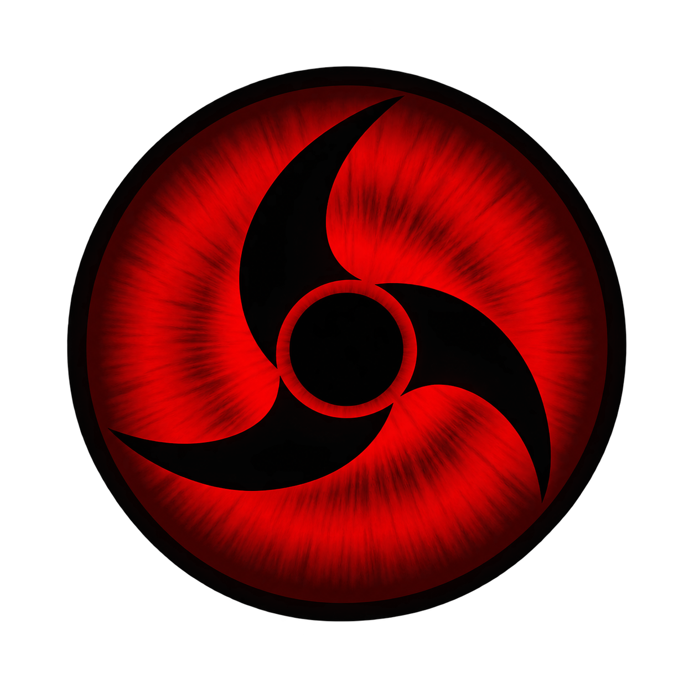
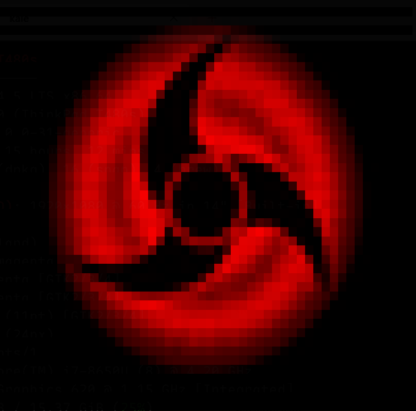

# Kale

<p align="center">
  
</p>

`kale` 将图片转换为高保真终端字符画。每个终端字符单元都拥有独立的 ANSI 24-bit True Color 前景色和背景色；它不是简单地给 ASCII 字符上色，而是为每个字符格拟合最接近原图的两种颜色。

支持 Windows Terminal、WezTerm、kitty、iTerm2，以及现代 VS Code 集成终端等 True Color 终端。

<p align="center">
  
    
</p>

## 安装

`kale` 是单个静态可执行文件，运行时不需要 Node.js、Python 或任何其他环境。

### Windows

下载 `kale-x86_64-pc-windows-msvc.msi` 并双击安装。安装向导默认勾选「把安装位置加入 PATH」，装完后**新开**一个终端即可直接使用 `kale`。也可以在「应用和功能」里正常卸载，卸载时会一并清除 PATH 项。

```powershell
# 静默安装，适合批量部署
msiexec /i kale-x86_64-pc-windows-msvc.msi /qn
```

如果只需要便携版，下载 `kale-x86_64-pc-windows-msvc.zip` 解压即可，不写注册表、不改 PATH。

### Linux

下载对应架构的 tar.xz，解压即用 —— 静态链接，不依赖 glibc 版本，也不需要安装步骤：

```bash
tar -xf kale-x86_64-unknown-linux-musl.tar.xz
./kale photo.png -w 100
```

想装到 `~/.local/bin` 并自动配好 PATH，用 shell 安装器：

```bash
curl --proto '=https' --tlsv1.2 -LsSf https://github.com/chunyujin295/kale/releases/latest/download/kale-installer.sh | sh
```

### macOS

下载 `kale-aarch64-apple-darwin.tar.xz`（Apple Silicon）或 `kale-x86_64-apple-darwin.tar.xz`（Intel）解压。产物未做代码签名，首次运行需要解除隔离属性：

```bash
xattr -d com.apple.quarantine ./kale
```

全部产物和校验和都在 [Releases](https://github.com/chunyujin295/kale/releases) 页面。

## 从源码构建

要求 Rust 1.85 或更高版本。

```bash
cargo build --release
cargo test
./target/release/kale photo.png --width 100
```

唯一的运行时依赖是编译进二进制的纯 Rust crate：图像解码用 `image`，字体查找用 `fontdb`，字形栅格化用 `fontdue`。没有 C 库、没有动态链接。

## 命令行

```text
kale <image> [options]
```

| 选项 | 说明 | 默认值 |
| --- | --- | --- |
| `-w, --width <columns>` | 字符画宽度，单位为终端列数，范围 1–1000 | `80` |
| `-m, --mode <mode>` | 渲染模式：`half`、`quadrant`、`braille`、`glyph` | `half` |
| `-f, --format <format>` | 输出格式：`ansi` 或 `html` | `ansi` |
| `-b, --background <#rrggbb>` | 透明 PNG/WebP 的合成背景色 | `#000000` |
| `--font <family>` | `glyph` 模式用于校准字形遮罩的字体 | `monospace` |
| `-h, --help` | 显示帮助 | — |

支持 PNG、JPEG、WebP、GIF 的静态首帧、TIFF 和 BMP。

> 与原 Node 版本相比，**不再支持 AVIF 输入**。解码 AVIF 需要链接 dav1d 这个 C 库，与「单个静态二进制、零运行时依赖」的目标冲突，因此移除了该格式。

## 渲染模式

| 模式 | 每格源采样 | 最适合 | 特点 |
| --- | --- | --- | --- |
| `half` | 1×2 | 默认 Logo、照片 | `▀` 上下双色块；速度最快、色彩最稳定 |
| `quadrant` | 2×2 | Fastfetch Logo、图标、插画 | Unicode 象限块；边缘更利落 |
| `braille` | 2×4 | 小尺寸图、纹理、线稿 | 盲文点阵；几何密度最高，但取决于终端字体 |
| `glyph` | 8×16 | 希望保留“字符画”风格的作品 | 对真实字符的抗锯齿覆盖率拟合前景/背景色 |

`half`、`quadrant` 和 `braille` 会枚举可用子像素掩码，把笔画覆盖区与未覆盖区各自拟合为一个 RGB 颜色，并选择总误差最小的字符。`glyph` 会先光栅化候选字符，再以最小二乘法求解前景色和背景色。

## 使用示例

### 默认真彩半块

```bash
kale photo.jpg -w 100
```

### 更适合图标的象限块

```bash
kale icon.png --width 48 --mode quadrant
```

### 高密度 Braille

```bash
kale drawing.png -w 90 -m braille
```

### 字形拟合，并匹配 Windows Terminal 常见字体

```bash
kale photo.png -w 96 -m glyph --font 'Cascadia Mono'
```

### 带透明通道的图像

```bash
kale logo.png -w 60 -m quadrant --background '#1e293b'
```

### 导出 HTML

```bash
kale photo.png -w 120 -m quadrant --format html > art.html
```

生成的 `art.html` 是可直接嵌入网页的 `<pre>` 片段，而非完整 HTML 文档。

## Fastfetch 集成

Fastfetch 可以直接显示 ANSI 真彩字符画；一定使用 `file-raw`，它不会篡改文件里的 ANSI 转义序列。

```powershell
kale .\logo.png -w 36 -m quadrant > $env:APPDATA\fastfetch\kale-logo.ansi
fastfetch --file-raw $env:APPDATA\fastfetch\kale-logo.ansi
```

将以下内容加入 Fastfetch 配置文件（可用 `fastfetch --list-config-paths` 找到目录）：

```jsonc
{
  "logo": {
    "type": "file-raw",
    "source": "C:/Users/你的用户名/AppData/Roaming/fastfetch/kale-logo.ansi",
    "padding": { "right": 2 }
  }
}
```

对 Fastfetch 而言，建议宽度为 30–40 列；通常优先选 `quadrant`。如果 Logo 太高，可降低 `--width`，因为工具会自动按终端字格比例保持图像比例。

## 验证与排错

```bash
cargo test
kale --help
```

- 输出只有灰色：终端可能不支持 True Color，或在管道/日志查看器中查看了 ANSI 输出。请在 Windows Terminal、WezTerm 或 VS Code 终端中直接运行。
- 画面偏扁或偏高：终端所用字体的宽高比与默认估计不同。`glyph` 模式请用 `--font` 指定你实际使用的等宽字体。
- Fastfetch 显示了控制字符：使用 `--file-raw`，不要使用 `--file`。
- `glyph` 模式的画面与原 Node 版本不完全相同：字形掩码由不同的光栅化器生成，此处不做字体 hinting，笔画边缘的覆盖率因此略有差异。指定明确的 `--font`（而不是默认的 `monospace`）能让结果更接近。

## 开发

```bash
cargo build --release
cargo test
```

测试分两层：

- `tests/render.rs` —— 颜色拟合、掩码选择、尺寸换算、HTML 输出的精确断言，不涉及 I/O。
- `tests/golden.rs` —— 与旧 Node 实现（sharp 0.34）的输出存档逐格比对，参考输出在 `tests/golden/`。

两套实现的图像解码与 alpha 合成结果逐字节相同，差异只来自 Lanczos3 重采样（libvips 与 `image` crate 的系数量化和累加方式不同）。因此金标准对比按层断言：网格尺寸严格相等，颜色在容差内，字形选择按一致率判定。

## 发布

推一个形如 `v0.1.0` 的 tag 即可触发构建与发布，产物包括 Windows MSI、Windows 便携 zip、Linux 静态二进制、macOS 双架构包、shell 安装器和校验和。CI 配置由 [dist](https://opensource.axo.dev/cargo-dist/) 生成，配置在 `dist-workspace.toml`；改动配置后运行 `dist generate` 重新生成 `.github/workflows/release.yml`，不要手工编辑它。
